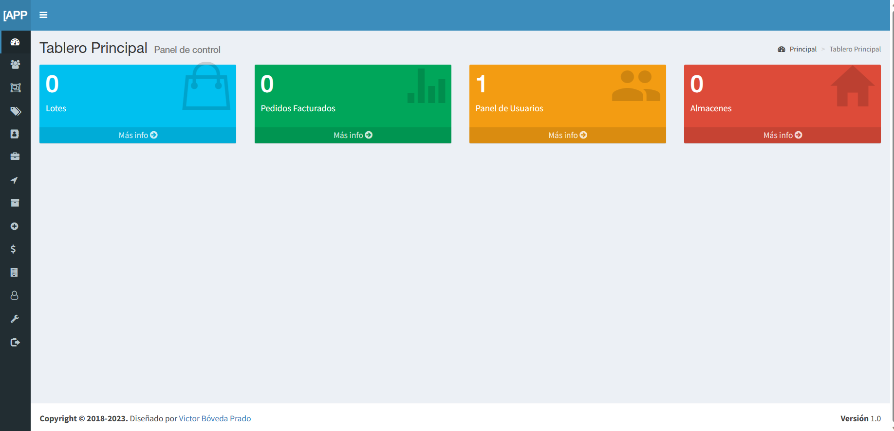

# STOCK APP

This app has been developed based on a previous project but extending it to the needs derived from my context.
I added more setcion wich allows to control articles, warehouses, clients, batches, providers, exits of stock, etc.
I implemented an export mechanism in xlsx for all the content.
The app's labels are developed in Spanish but can be updated to any language.
The app theme locks as follows:

## Installation

Needs to run the application in XAMPP or another server alternative. First of all you need to load the
bd.sql script in a database named 'mystock'. Then you can modify this scripts and name and resources 
based on your needs.
